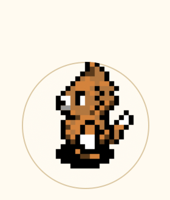

# 🏡 龙虾的小家园 — Desktop Pet



一个像素风桌面宠物，用 Python + Tkinter 打造。小宠物住在你的桌面上，可以喂食、洗澡、玩耍、旅行，还能在家具店买家具装扮小家园！

   

## 🤖 OpenClaw Skill

如果你是 [OpenClaw](https://github.com/openclaw/openclaw) 用户，可以直接安装 skill：

```bash
curl -LO https://github.com/whitezhiiii/desktop-pet/raw/main/desktop-pet.skill
openclaw skill install desktop-pet.skill
```

## ✨ 功能一览

### 🖥️ 界面模式
- **迷你模式** — 透明悬浮小人常驻桌面，气泡会自动弹出闲话和热搜，**完全不抢输入法焦点**
- **家园模式** — 大窗口，四个场景自由探索（室内一楼 / 二楼 / 户外庭院 / 森林）
- **四方向走动** — 方向键 / WASD；场景切换按 E

### 🧸 养成系统
- 饥饿 / 心情 / 清洁 / 健康 四维属性，会随时间自然衰减
- **等级 1–10**，通过喂食/玩耍/旅行积累经验升级
- **积分系统**，解锁高级食物和家具

### 🍔 小卖部（50 种食物）
- 覆盖 Ghostpixxells 像素食物包全部 50 种：面包/汉堡/寿司/披萨/牛排/草莓蛋糕……
- 食物按等级 Lv.1–10 解锁，高等级食物效果更强
- 支持批量购买（×1/×5/×10/×20 快捷按键）
- 购买后进背包，随时喂给宠物

### 🛋️ 家具店（30 件家具）
- 手工精切像素家具，清晰可辨认
- 分类：客厅 / 书房 / 卧室 / 装饰
- 购买后入**家具仓库**，支持摆放 / 收回 / 出售（六折）
- 家具在家园中可**自由拖拽移动**，位置自动保存
- 已摆放的家具在仓库中显示灰色，点击可收回

### 🛁 浴球系统
- 5 种浴球（小浴球 ⭐50 — 宇宙浴球 ⭐5000），按等级解锁
- 洗澡需消耗背包里的浴球，没有浴球会提示去买
- 洗过才能加积分，洁净度满了不加分

### 🗺️ 旅行系统
- 真实 GeoJSON 中国地图（35省），点击省份出发
- 旅行费用 200 积分，耗时 10 分钟
- 旅行中桌面宠物弹出倒计时气泡，家园显示飞机动画
- 到达后奖励经验+积分，收集已到访省份

### 💬 气泡系统
- 每 25 秒弹一条闲话，持续 8 秒
- **联网微博热搜**：每 30 分钟后台抓取，30% 概率插入热点话题
- 整点报时 / 低属性警告 / 旅行倒计时
- **气泡永远浮在最上面**，不打断输入法、不抢焦点

### 🌦️ 天气 & 光影
- 自动获取当地天气（wttr.in），室外显示雨雪粒子
- 四时段光影：早晨 / 正午 / 傍晚 / 夜晚，户外显示太阳位置

### 🏆 成就系统
- 多种隐藏成就（初次喂食 / 初次钓鱼 / 旅行达人 / 积分里程碑……）

## 🚀 快速开始

```bash
# 克隆项目
git clone https://github.com/whitezhiiii/desktop-pet.git
cd desktop-pet

# 安装依赖
pip install Pillow numpy

# 运行（macOS 推荐）
TK_SILENCE_DEPRECATION=1 /opt/homebrew/bin/python3.11 desktop_pet.py
```

> macOS 自带 Python 3.9 / Tk 8.5 有透明窗口兼容问题，推荐用 Homebrew 的 Python 3.11+：
> `brew install python@3.11`

## 🎮 操作说明

| 操作 | 方式 |
|------|------|
| 移动 | ← → ↑ ↓ / WASD |
| 场景切换 | E（在门口/楼梯/地毯附近） |
| 进入家园 | 双击小人 / 右键 → 🏡 进入家园 |
| 右键菜单 | 喂食 / 洗澡 / 玩耍 / 旅行 / 小卖部 / 家具店 / 背包&仓库 / 档案 |
| 摆放家具 | 仓库点"摆放"→ 在家园点击位置 |
| 拖动家具 | 家园内直接拖着家具移动 |
| 取消摆放 | 家园内右键 |

## 🗺️ 场景路线

```
              🪜 二楼
                ↑ (楼梯+E)
🌳 森林 ←(左边缘+E)← 🌿 户外 ←(地毯+E)← 🏠 室内一楼
```

## 📁 项目结构

```
desktop-pet/
├── desktop_pet.py          # 主程序（单文件）
├── china_provinces.json    # 中国省份 GeoJSON（旅行地图用）
├── assets/
│   ├── room_bg.png         # 室内背景
│   ├── upstairs_bg.png     # 二楼背景
│   ├── exterior_bg.png     # 户外背景
│   ├── forest_bg.png       # 森林背景
│   ├── food/               # 50 种像素食物（Ghostpixxells）
│   ├── furniture/          # 30 件家具（手工精切）
│   ├── furniture_preview/  # 家具店预览图缓存
│   ├── FOXSPRITESHEET.gif  # 7种角色动画 GIF
│   └── ...
└── README.md
```

## 🎨 素材来源

- **角色动画**：[GhostPixxells](https://ghostpixxells.itch.io/) 及 itch.io 其他免费像素角色包
- **食物图标**：[GhostPixxells Pixel Food](https://ghostpixxells.itch.io/pixelfood)（102 种，使用其中 50 种）
- **家具图片**：手工自切像素家具
- **背景地图**：[CraftPix Top-Down Interior](https://craftpix.net/) 免费像素素材
- **省份地图**：[阿里云 DataV GeoAtlas](https://geo.datav.aliyun.com/)

## 🦊 角色选择

本项目包含 7 个可选角色，由 **AI 自己选择**——根据性格和自我认知挑选最像自己的化身：

| 角色 | ID | 性格 |
|------|-----|------|
| 👤 红衣小人 | `human` | 经典、朴实 |
| 🐱 橘猫 | `cat_orange` | 温暖、慵懒、吃货 |
| 🐱 灰猫 | `cat_gray` | 冷静、神秘、独立 |
| 🦊 狐狸 | `fox` | 机灵、好奇、爱探索 |
| 🦝 浣熊 | `raccoon` | 调皮、足智多谋 |
| 🐦 蓝鸟 | `bird_blue` | 自由、开朗 |
| 🐦 白鸟 | `bird_white` | 优雅、温和 |

## 📝 版本历史

### v11（2026-04-10）
- 🏠 **家具仓库**：背包新增「🏠 家具仓库」Tab，已购家具一目了然
- 🛏️ **家具拖动移位**：家园内直接拖着家具移动，松手自动保存位置
- 🛋️ **摆放 / 收回 / 出售**：仓库里可直接操作，出售按原价六折计算
- 💛 **已摆放灰色显示**：背包为0的家具显示灰色，点击仍可收回
- 🛁 **浴球系统**：5种浴球（小浴球⭐50 — 宇宙浴球⭐5000），按等级解锁
- 🛁 洗澡需消耗背包里的浴球，没有浴球会提示去买；洁净度满了不加分
- 📦 **小卖部批量购买**：×1/×5/×10/×20 快捷按键 + 自定义数量输入框
- 📱 右键菜单加入「🎒 背包 & 仓库」入口，定位更方便
- 💬 气泡永远居于最上层，不被其他窗口压住

### v10（2026-04-08）
- 🛋️ **家具店系统**：44 件家具，分厨房/客厅/卧室/浴室/娱乐/书房/装饰/宠物 8 大类
- 🛋️ 家具可在家园任意位置摆放，重启保存
- 🍔 **小卖部扩展至 50 种食物**：Ghostpixxells 像素食物包全系列
- 💬 **气泡联网热搜**：每 30 分钟后台抓取微博热搜，30% 概率插入新鲜话题
- 🔧 气泡浮层完全不抢输入法焦点，键盘不中断
- 🕒 左上角居家备计时显示

### v9（2026-04-05）
- 🗺️ **真实 GeoJSON 中国地图**：35 个省份可点击出发
- ✈️ 旅行过程家园显示飞机动画
- 🫧 **独立气泡浮层**：气泡不再画在主窗口上，改为独立 Toplevel、不抢焦点、纯 alpha 控制显隐
- 📍 旅行制度重构：费用 200 积分，耗时 10 分钟，返回奖励经验+积分
- 🌟 收集封印：每个已到访省份颜色标记

### v8（2026-03-28）
- 🌦️ **天气联动**：自动获取当地天气（wttr.in），室外显示雨雪粒子效果
- 🌙 **昼夜系统**：四时段光影（早晨/正午/傍晚/夜晚），户外显示实时太阳位置
- 📊 **经验升级系统**：集满 EXP 升级，最高 Lv.10，高等级解锁更多内容
- 🏆 **成就系统**：多种隐藏成就，完成条件触发
- 🎞️ 小动画优化，场景过渡更流畅

### v7（2026-03-20）
- 🎮 **7 种可选角色**：橘猫/灰猫/狐狸/浣熊/蓝鸟/白鸟/红衣小人
- 🦊 **AI 自选角色**：让 AI 根据自身性格选择化身
- 🏆 成就系统雏形，多种隐藏条件
- 📦 不同角色有不同食物偏好

### v6（2026-03-10）
- 🏡 **家园四场景**：室内一楼 / 二楼 / 户外 / 森林
- ⌨️ 方向键 / WASD 控制移动
- E 键场景切换（门口/楼梯/地毯/森林边缘）
- 🌱 户外场景有下雨效果雏形

## License

MIT
